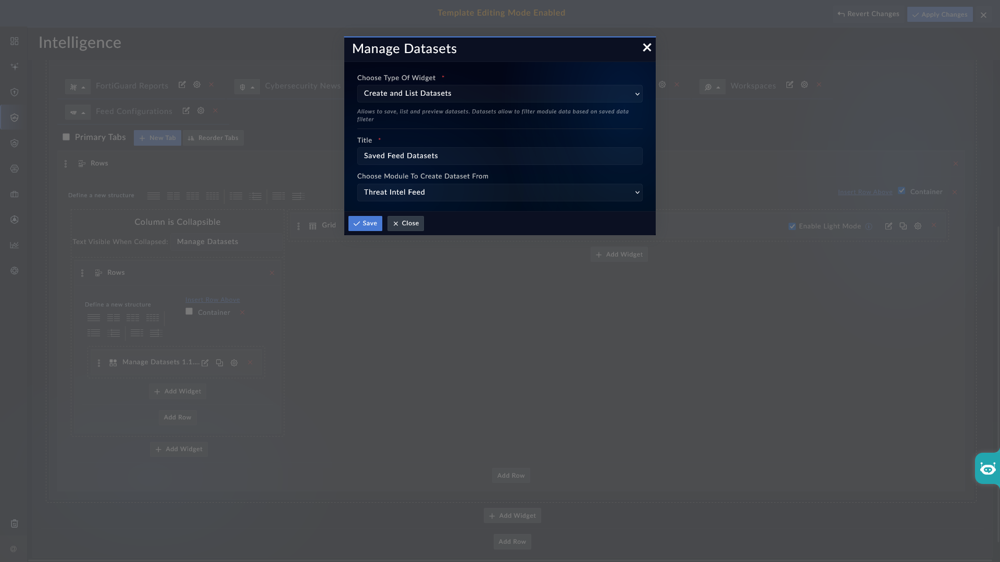

| [Home](../README.md) |
| -------------------- |

# Installation

1. In FortiSOAR, navigate to **Content Hub** > **Discover**.
2. From the list of widgets, search for **Manage Datasets**.
3. Click the **Manage Datasets** widget card.
4. Click **Install** at the bottom of the card to begin installation.

# Configuration

To configure the **Manage Datasets** widget:

1. Navigate to the list view panel where you want to add the widget.
2. Click **Edit Template** to open the template editor.
3. Click **Add Widget** and select **Manage Datasets** from the list.
4. The **Edit Manage Datasets** configuration form opens. Fill in the fields described in this section.
5. Click **Save** to apply the configuration.

## Title

Enter a display name for the widget. This title appears as the heading for the dataset panel. For example, enter `Phishing Threat Feeds` to label a Threat Feeds tagged as *Phishing*.

## Data Source

Select the FortiSOAR module from which datasets are created. For example, select `Threat Intel Feed` to create datasets that filter threat intelligence feed records, or select `Alerts` to create datasets that filter alert records.

## Next Steps

| [Usage](./usage.md) |
| ------------------- |
