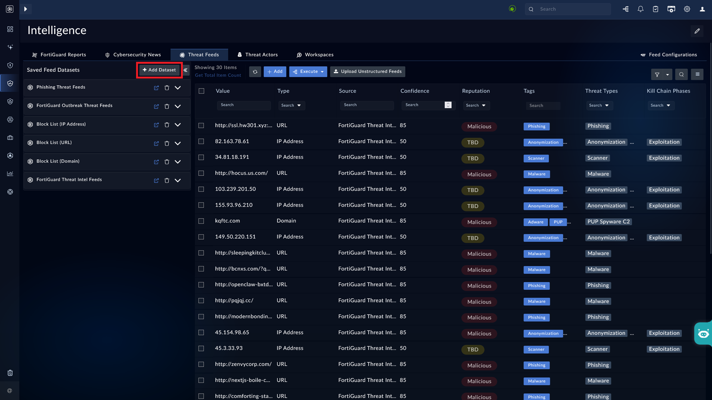
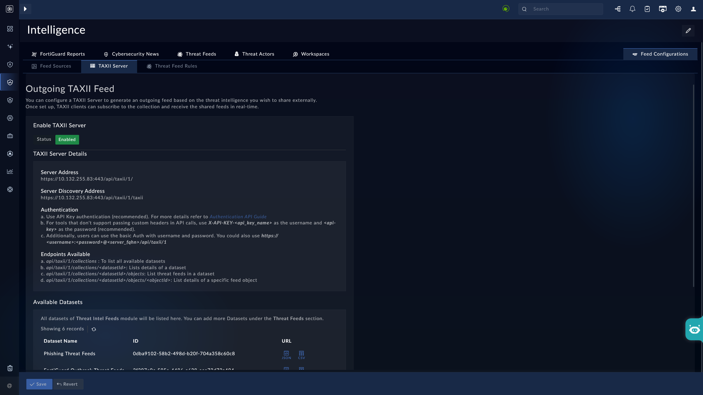

| [Home](../README.md) |
| --------------------- |

# Usage

Once added to a list view panel, the **Manage Datasets** widget lets you create datasets. Each dataset consists of a label and a set of filter criteria, and acts as a saved filter that you can apply to instantly view matching records without rebuilding the filter each time.

Datasets created from any module are also listed centrally on the **TAXII Server** tab, regardless of which module they were created from.

## Example 1: Creating a Dataset in Threat Intel Management

The **Manage Datasets** widget is available by default on the **Threat Feeds** tab of the **Threat Intel Management** page.

### Adding a Dataset

1. Navigate to <picture><source media="(prefers-color-scheme: dark)" srcset="./res/icon-threat-intel-management-light.svg"><source media="(prefers-color-scheme: light)" srcset="./res/icon-threat-intel-management-dark.svg"></picture> **Threat Intelligence** <picture><source media="(prefers-color-scheme: dark)" srcset="./res/icon-chevron-light.svg"><source media="(prefers-color-scheme: light)" srcset="./res/icon-chevron-dark.svg"></picture> <picture><source media="(prefers-color-scheme: dark)" srcset="./res/icon-threat-intelligence-light.svg"><source media="(prefers-color-scheme: light)" srcset="./res/icon-threat-intelligence-dark.svg"></picture> **Hub**.

2. Click the tab **Threat Feeds**.

    

3. Click the button <picture><source media="(prefers-color-scheme: dark)" srcset="./res/icon-add-light.svg"><source media="(prefers-color-scheme: light)" srcset="./res/icon-add-dark.svg"></picture> **Add Dataset**, under the tab **Threat Feeds**.

4. Enter the **Dataset Label** and **Filter Criteria** to filter the targeted dataset.

5. Click **Save Dataset**.

To view the dataset, click the **Preview Dataset** icon next to the saved dataset. This applies the filter and displays only the matching records, in a new overlay, such as feed records where **Tag** is **Phishing**.

## Example 2: Creating a Dataset in the Alerts List View

The **Manage Datasets** widget can also be added to the list view panel of other modules, such as **Alerts**. The following steps assume the widget has already been added to the Alerts list view panel, with the **Title** field set to `Critical Alerts`.

Refer to the section [Adding a Dataset](#adding-a-dataset) to add a work with a dataset

## Viewing All Datasets via the TAXII Server Tab

All datasets created using the **Manage Datasets** widget, regardless of the module they were created from, can be listed centrally on the **TAXII Server** tab.

To view all created datasets:

1. Navigate to **Intelligence** > **Feed Configurations** > **TAXII Server**.
2. Under **Available Datasets**, all datasets created across modules — including Threat Intel Feeds, Alerts, and Indicators — are listed with their **Dataset Name**, **ID**, and **URL**.

> [!NOTE]
> 
> The **TAXII Server** tab also lets you configure an outgoing TAXII feed, so that the listed datasets can be consumed by external TAXII clients.
> 

## Next Steps

| [Installation](./setup.md#installation) | [Configuration](./setup.md#configuration) |
| ------------------------------------------ | --------------------------------------------- |
