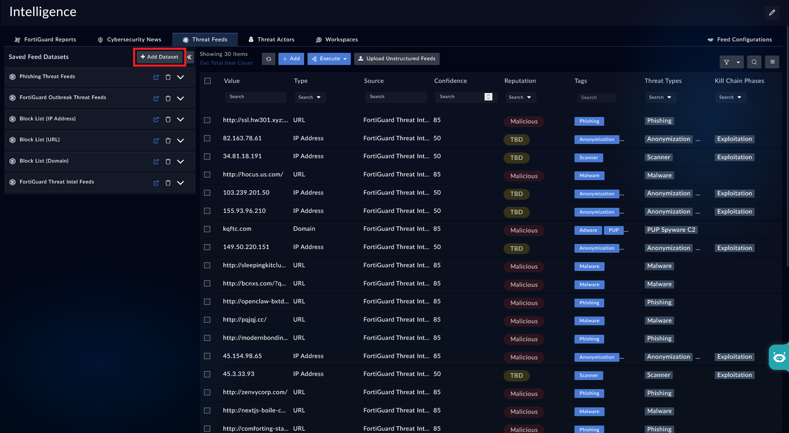
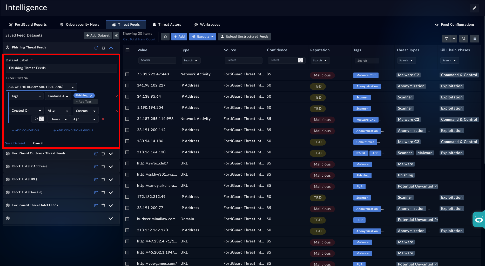
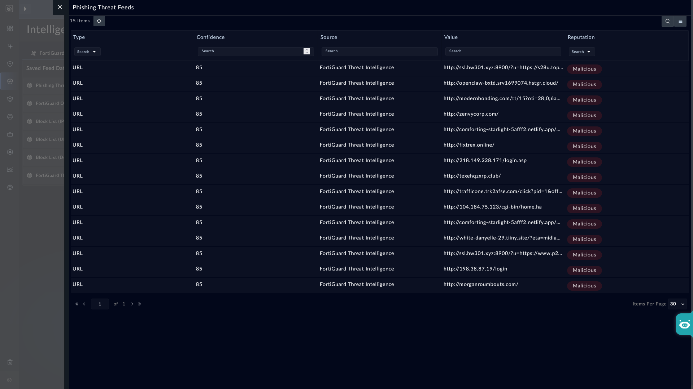
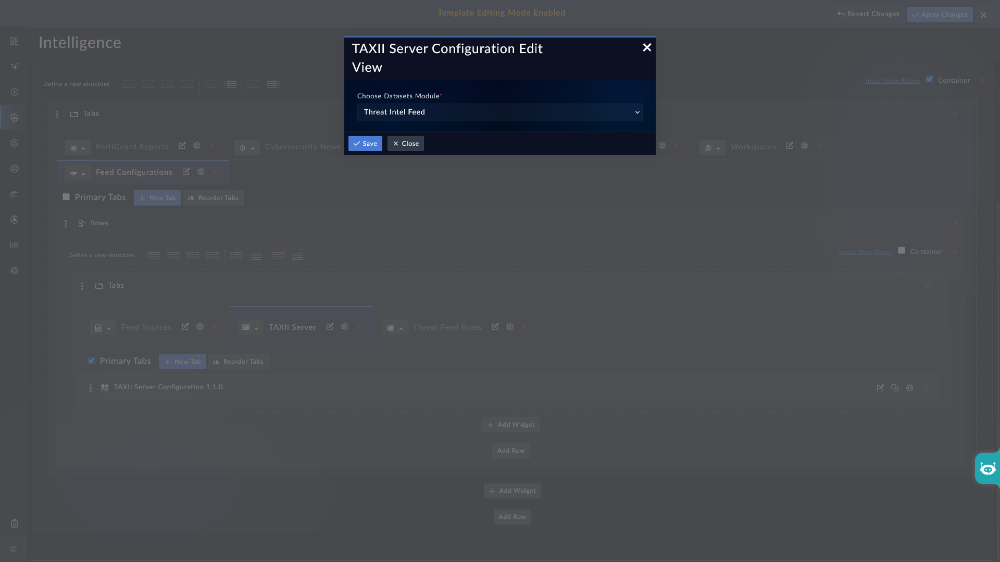

| [Home](../README.md) |
| -------------------- |

# Usage

Once added to a list view panel, the **Manage Datasets** widget lets you create datasets. Each dataset consists of a label and a set of filter criteria, and acts as a saved filter that you can apply to instantly view matching records without rebuilding the filter each time.

## Example 1: Adding a Dataset in Threat Intel Management

The **Manage Datasets** widget is available by default on the **Threat Feeds** tab.

To create a dataset:

1. Navigate to <picture><source media="(prefers-color-scheme: dark)" srcset="./res/icon-threat-intel-management-light.svg"><source media="(prefers-color-scheme: light)" srcset="./res/icon-threat-intel-management-dark.svg"></picture> **Threat Intelligence** <picture><source media="(prefers-color-scheme: dark)" srcset="./res/icon-chevron-light.svg"><source media="(prefers-color-scheme: light)" srcset="./res/icon-chevron-dark.svg"></picture> <picture><source media="(prefers-color-scheme: dark)" srcset="./res/icon-threat-intelligence-light.svg"><source media="(prefers-color-scheme: light)" srcset="./res/icon-threat-intelligence-dark.svg"></picture> **Hub** <picture><source media="(prefers-color-scheme: dark)" srcset="./res/icon-chevron-light.svg"><source media="(prefers-color-scheme: light)" srcset="./res/icon-chevron-dark.svg"></picture> **Threat Feeds** tab.

2. On the **Manage Datasets** widget, click **Add Dataset**.

    

3. In the **Dataset Label** field, enter a name for the dataset, for example, `Phishing Threat Feeds`.

    

4. In the **Filter Criteria** section, click **+ Add Condition** and define the condition:

   > `Tags` *Contains Any* `Phishing`

5. Click **Save Dataset**.

To view the dataset, click <picture><source media="(prefers-color-scheme: dark)" srcset="./res/icon-external-link-light.svg"><source media="(prefers-color-scheme: light)" srcset="./res/icon-external-link-dark.svg"></picture> next to the saved dataset. This applies the filter and displays only the matching records, such as feed records containing the `Phishing` tag.

## Example 2: Adding a Dataset in the Alerts List View

The **Manage Datasets** widget can also be added to the list view panel of other modules, such as **Alerts**. The following steps assume the widget has already been added to the Alerts list view panel, with the **Title** field set to `Critical Alerts` (see [Configuration](./setup.md#configuration)).

To add a dataset:

1. Navigate to <picture><source media="(prefers-color-scheme: dark)" srcset="./res/icon-incident-response-light.svg"><source media="(prefers-color-scheme: light)" srcset="./res/icon-incident-response-dark.svg"></picture> **Security Operations** <picture><source media="(prefers-color-scheme: dark)" srcset="./res/icon-chevron-light.svg"><source media="(prefers-color-scheme: light)" srcset="./res/icon-chevron-dark.svg"></picture> <picture><source media="(prefers-color-scheme: dark)" srcset="./res/icon-alert-light.svg"><source media="(prefers-color-scheme: light)" srcset="./res/icon-alert-dark.svg"></picture> **Alerts**.

2. On the **Manage Datasets** widget, click **Add Dataset**.

3. In the **Dataset Label** field, enter a name for the dataset, for example, `Critical Severity`.

4. In the **Filter Criteria** section, click **+ Add Condition** and define the condition `Severity Equals Critical`.

5. Click **Save Dataset**.

As with Example 1, click <picture><source media="(prefers-color-scheme: dark)" srcset="./res/icon-external-link-light.svg"><source media="(prefers-color-scheme: light)" srcset="./res/icon-external-link-dark.svg"></picture> next to the saved dataset to apply the filter and display only the matching alert records.

## Making Datasets Available via the TAXII Server

The **TAXII Server** widget, available under Navigate to <picture><source media="(prefers-color-scheme: dark)" srcset="./res/icon-threat-intel-management-light.svg"><source media="(prefers-color-scheme: light)" srcset="./res/icon-threat-intel-management-dark.svg"></picture> **Threat Intelligence** <picture><source media="(prefers-color-scheme: dark)" srcset="./res/icon-chevron-light.svg"><source media="(prefers-color-scheme: light)" srcset="./res/icon-chevron-dark.svg"></picture> <picture><source media="(prefers-color-scheme: dark)" srcset="./res/icon-threat-intelligence-light.svg"><source media="(prefers-color-scheme: light)" srcset="./res/icon-threat-intelligence-dark.svg"></picture> **Hub** <picture><source media="(prefers-color-scheme: dark)" srcset="./res/icon-chevron-light.svg"><source media="(prefers-color-scheme: light)" srcset="./res/icon-chevron-dark.svg"></picture> **Feed Configurations** > **TAXII Server**, can be configured to list datasets created by the **Manage Datasets** widget. The TAXII Server widget must be pointed to the module where the **Manage Datasets** widget is added and has at least one dataset created.

To configure the TAXII Server widget to list datasets from a module:

1. Navigate to Navigate to <picture><source media="(prefers-color-scheme: dark)" srcset="./res/icon-threat-intel-management-light.svg"><source media="(prefers-color-scheme: light)" srcset="./res/icon-threat-intel-management-dark.svg"></picture> **Threat Intelligence** <picture><source media="(prefers-color-scheme: dark)" srcset="./res/icon-chevron-light.svg"><source media="(prefers-color-scheme: light)" srcset="./res/icon-chevron-dark.svg"></picture> <picture><source media="(prefers-color-scheme: dark)" srcset="./res/icon-threat-intelligence-light.svg"><source media="(prefers-color-scheme: light)" srcset="./res/icon-threat-intelligence-dark.svg"></picture> **Hub** <picture><source media="(prefers-color-scheme: dark)" srcset="./res/icon-chevron-light.svg"><source media="(prefers-color-scheme: light)" srcset="./res/icon-chevron-dark.svg"></picture> **Feed Configurations** <picture><source media="(prefers-color-scheme: dark)" srcset="./res/icon-chevron-light.svg"><source media="(prefers-color-scheme: light)" srcset="./res/icon-chevron-dark.svg"></picture> **TAXII Server**.
2. Click **Edit Template** to open the template editor, then click the edit icon on the **TAXII Server** widget.
3. In the **Choose Datasets Module** field, select the module where the **Manage Datasets** widget is added — for example, `Threat Intel Feed` for Example 1, or `Alerts` for Example 2.
4. Click **Save**.

Once configured, the datasets created from the selected module are listed under **Available Datasets** on the TAXII Server page, with their **Dataset Name**, **ID**, and **URL**.

For full details on configuring and using the TAXII Server, see [Setting up a TAXII Server](https://github.com/fortinet-fortisoar/solution-pack-threat-intel-management/blob/release/4.0.0/docs/taxii.md#setting-up-a-taxii-server).

## Next Steps

| [Installation](./setup.md#installation) | [Configuration](./setup.md#configuration) |
| --------------------------------------- | ----------------------------------------- |
